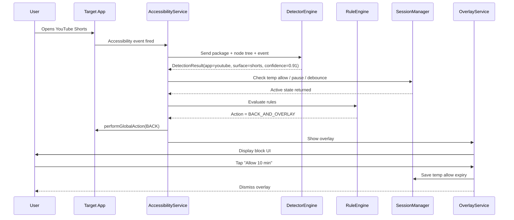

# Focus Guard Developer Task Plan
**Project:** Jamaat Time — Focus Guard (Shorts/Reels Blocker)  
**Target stack:** Flutter + Native Android (Kotlin)  
**Goal:** Build an MVP in the safest implementation order so each step is testable and does not break the rest of the app.

---

# 1. Implementation strategy

Build in this order:

1. **Scaffold the feature**
2. **Add Android permissions and settings entry points**
3. **Create native settings storage**
4. **Create the Flutter/native bridge**
5. **Create AccessibilityService skeleton**
6. **Create overlay skeleton**
7. **Implement detector engine**
8. **Implement rule engine**
9. **Implement temporary allow / pause logic**
10. **Build Flutter settings UI**
11. **Build history / status UI**
12. **QA on real devices**
13. **Harden for production**

Do **not** start with full detection for every app.  
Start with **YouTube Shorts only** and make that stable first.

---

# 2. File-by-file implementation order

## Phase 0 — Project scaffolding

### 0.1 Create Flutter feature folders
**Files**
- `lib/features/focus_guard/presentation/`
- `lib/features/focus_guard/application/`
- `lib/features/focus_guard/domain/`
- `lib/features/focus_guard/data/`

**Task**
- Create clean feature boundaries before writing logic.

**Done when**
- Folder structure exists and app still builds.

---

## Phase 1 — Domain models first

### 1.1 Create `focus_guard_settings.dart`
**Path**
- `lib/features/focus_guard/domain/focus_guard_settings.dart`

**Responsibilities**
- Define top-level settings model
- Hold enabled state, mode, prayer rules, custom windows, overlay/back behavior

**Task**
- Create immutable Dart model
- Add `toJson`, `fromJson`, `copyWith`

**Done when**
- Model serializes/deserializes correctly

---

### 1.2 Create `blocked_app_rule.dart`
**Path**
- `lib/features/focus_guard/domain/blocked_app_rule.dart`

**Responsibilities**
- Per-app rule definition
- Store enabled flag, surfaces, quick-allow presets, cooldown

**Task**
- Add constants for `youtube`, `instagram`, `facebook`, `tiktok`

**Done when**
- One settings object can include multiple app rules cleanly

---

### 1.3 Create `blocking_rule.dart`
**Path**
- `lib/features/focus_guard/domain/blocking_rule.dart`

**Responsibilities**
- Enums and small rule models:
  - `BlockingMode`
  - `PrayerAwareRule`
  - `TimeWindowRule`

**Done when**
- All settings dependencies compile cleanly

---

### 1.4 Create `guard_event.dart`
**Path**
- `lib/features/focus_guard/domain/guard_event.dart`

**Responsibilities**
- Local event history model
- Track timestamp, appId, surface, actionTaken, confidence

**Done when**
- You can create fake events for testing UI

---

## Phase 2 — Flutter controller and repository contracts

### 2.1 Create `focus_guard_controller.dart`
**Path**
- `lib/features/focus_guard/application/focus_guard_controller.dart`

**Responsibilities**
- Central state holder for Flutter side
- Load/save settings
- Ask native side for statuses
- Start setup actions

**Task**
- Expose:
  - `load()`
  - `saveSettings()`
  - `refreshPermissionStatus()`
  - `openAccessibilitySettings()`
  - `openOverlaySettings()`

**Done when**
- UI can call controller without native implementation finished

---

### 2.2 Create `focus_guard_channel_repository.dart`
**Path**
- `lib/features/focus_guard/data/focus_guard_channel_repository.dart`

**Responsibilities**
- Platform channel bridge wrapper
- Convert Dart models <-> JSON maps
- Call native methods safely

**Task**
- Stub methods:
  - `getPermissionStatus()`
  - `getSettings()`
  - `saveSettings()`
  - `getHistory()`
  - `openAccessibilitySettings()`
  - `openOverlaySettings()`

**Done when**
- App compiles with mocked native responses

---

### 2.3 Create `focus_guard_permission_service.dart`
**Path**
- `lib/features/focus_guard/application/focus_guard_permission_service.dart`

**Responsibilities**
- Flutter-friendly abstraction over permission status and setup guidance

**Done when**
- Controller logic stays clean

---

## Phase 3 — Flutter UI skeleton

### 3.1 Create `focus_guard_home_page.dart`
**Path**
- `lib/features/focus_guard/presentation/focus_guard_home_page.dart`

**Responsibilities**
- Main entry screen
- Show master toggle, status, blocked apps summary, quick actions

**Task**
- Use mock state first
- Do not wait for native logic

**Done when**
- Basic screen is navigable inside Jamaat Time

---

### 3.2 Create `focus_guard_setup_page.dart`
**Path**
- `lib/features/focus_guard/presentation/focus_guard_setup_page.dart`

**Responsibilities**
- Guided onboarding for permissions
- Explain accessibility and overlay need

**Done when**
- User can reach permission buttons from UI

---

### 3.3 Create `app_selection_page.dart`
**Path**
- `lib/features/focus_guard/presentation/app_selection_page.dart`

**Responsibilities**
- Toggle apps on/off
- Set app-specific presets

---

### 3.4 Create `blocking_rules_page.dart`
**Path**
- `lib/features/focus_guard/presentation/blocking_rules_page.dart`

**Responsibilities**
- Blocking mode
- prayer-aware rules
- custom time windows

---

### 3.5 Create `history_page.dart`
**Path**
- `lib/features/focus_guard/presentation/history_page.dart`

**Responsibilities**
- Show block history and basic stats

**Done when for Phase 3**
- All screens exist and navigate
- Mock data works
- No native dependency yet

---

## Phase 4 — Android manifest and permissions

### 4.1 Update `AndroidManifest.xml`
**Path**
- `android/app/src/main/AndroidManifest.xml`

**Responsibilities**
- Register AccessibilityService
- Add overlay permission
- Register service metadata and overlay service if needed

**Task**
- Add `SYSTEM_ALERT_WINDOW`
- Add `<service>` for `FocusGuardAccessibilityService`
- Add accessibility-service config XML reference

**Done when**
- App installs and service entry appears in Accessibility settings

---

### 4.2 Create accessibility config XML
**Path**
- `android/app/src/main/res/xml/focus_guard_accessibility_service.xml`

**Responsibilities**
- Define event types, feedback type, package options, flags

**Task**
- Start narrow:
  - window state changed
  - window content changed

**Done when**
- Android recognizes the service correctly

---

## Phase 5 — Native settings and platform bridge

### 5.1 Create `FocusGuardSettingsStore.kt`
**Path**
- `android/app/src/main/kotlin/.../focusguard/FocusGuardSettingsStore.kt`

**Responsibilities**
- Persist settings in native storage
- Make settings available even when Flutter UI is not running

**Task**
- Use DataStore or SharedPreferences
- Read/write JSON string
- Provide default settings

**Done when**
- Native side can save/load settings independently

---

### 5.2 Create `FocusGuardMethodChannel.kt`
**Path**
- `android/app/src/main/kotlin/.../focusguard/FocusGuardMethodChannel.kt`

**Responsibilities**
- Expose native methods to Flutter

**Methods**
- `getPermissionStatus`
- `getSettings`
- `saveSettings`
- `openAccessibilitySettings`
- `openOverlaySettings`
- `getHistory`

**Done when**
- Flutter can talk to Android for these methods

---

### 5.3 Wire channel in `MainActivity.kt`
**Path**
- `android/app/src/main/kotlin/.../MainActivity.kt`

**Responsibilities**
- Register channel/plugin bridge

**Done when**
- Flutter gets real native responses

---

## Phase 6 — Accessibility service skeleton

### 6.1 Create `FocusGuardAccessibilityService.kt`
**Path**
- `android/app/src/main/kotlin/.../focusguard/FocusGuardAccessibilityService.kt`

**Responsibilities**
- Listen to accessibility events
- Extract package name and root node
- Forward to detector engine
- Ask rule engine what action to take

**Task**
- Implement skeleton only first
- Log every relevant event from selected packages
- No blocking yet

**Done when**
- You can see logs when opening YouTube

---

### 6.2 Add package filter helper
**Path**
- inside `FocusGuardAccessibilityService.kt` or separate util

**Responsibilities**
- Ignore irrelevant packages fast
- Reduce CPU overhead

**Done when**
- Only selected app events are processed

---

## Phase 7 — Detector engine

### 7.1 Create `FocusGuardDetectorEngine.kt`
**Path**
- `android/app/src/main/kotlin/.../focusguard/FocusGuardDetectorEngine.kt`

**Responsibilities**
- Route events to app-specific detectors
- Return standardized `DetectionResult`

**Done when**
- Service has a single entry point for detection

---

### 7.2 Create `AppDetector.kt`
**Path**
- `android/app/src/main/kotlin/.../focusguard/AppDetector.kt`

**Responsibilities**
- Common interface for all detectors

**Suggested shape**
```kotlin
interface AppDetector {
    fun detect(input: DetectionInput): DetectionResult?
}
```

---

### 7.3 Create `YouTubeDetector.kt`
**Path**
- `android/app/src/main/kotlin/.../focusguard/YouTubeDetector.kt`

**Responsibilities**
- Detect YouTube Shorts only

**Task**
- Start with multi-signal matching:
  - package name
  - visible text `Shorts`
  - selected tab / viewer signals
- Return confidence and reason codes

**Done when**
- Detection works on real device with acceptable false positives

---

### 7.4 Create placeholders
**Files**
- `InstagramDetector.kt`
- `FacebookDetector.kt`
- `TikTokDetector.kt`

**Responsibilities**
- Stub only for MVP
- Return null until Phase 2/3

**Done when**
- Engine architecture supports expansion

---

## Phase 8 — Rule engine

### 8.1 Create `FocusGuardRuleEngine.kt`
**Path**
- `android/app/src/main/kotlin/.../focusguard/FocusGuardRuleEngine.kt`

**Responsibilities**
- Decide action from detection + settings + session state

**Inputs**
- detection result
- settings
- temporary allow state
- active schedule state
- debounce state

**Outputs**
- ignore
- show overlay
- back and overlay
- log only

**Done when**
- Decisions are deterministic and testable

---

### 8.2 Add debounce / duplicate suppression
**Path**
- same engine or session manager

**Responsibilities**
- Prevent repeated trigger storms from content-changed events

**Done when**
- Overlay does not flash repeatedly

---

## Phase 9 — Overlay implementation

### 9.1 Create `FocusGuardOverlayService.kt`
**Path**
- `android/app/src/main/kotlin/.../focusguard/FocusGuardOverlayService.kt`

**Responsibilities**
- Show blocker overlay quickly
- Handle buttons:
  - back
  - allow 5 min
  - allow 10 min
  - pause until next prayer

**Task**
- Build minimal production-safe UI first
- Native-only, not Flutter-rendered

**Done when**
- Overlay appears over YouTube Shorts reliably

---

### 9.2 Create overlay layout XML
**Path**
- `android/app/src/main/res/layout/focus_guard_overlay.xml`

**Responsibilities**
- Native overlay view layout

**UI**
- title
- subtitle
- reminder text
- countdown / next prayer
- action buttons

---

### 9.3 Add overlay controller/helper
**Path**
- `android/app/src/main/kotlin/.../focusguard/OverlayWindowController.kt`

**Responsibilities**
- Attach/remove/update overlay safely
- Prevent duplicate overlay instances

**Done when**
- Overlay lifecycle is stable

---

## Phase 10 — Session and temporary access

### 10.1 Create `FocusGuardSessionManager.kt`
**Path**
- `android/app/src/main/kotlin/.../focusguard/FocusGuardSessionManager.kt`

**Responsibilities**
- Store temporary allow windows
- Store pause-until-next-prayer expiry
- Store recent block timestamps

**Methods**
- `isTemporarilyAllowed(appId)`
- `grantTemporaryAllow(appId, minutes)`
- `pauseUntil(timestamp)`
- `isPausedNow()`

**Done when**
- Overlay button actions work end-to-end

---

### 10.2 Connect overlay actions to session manager
**Task**
- When user taps allow:
  - save expiry
  - dismiss overlay
- When user taps pause until next prayer:
  - calculate next prayer timestamp
  - save expiry
  - dismiss overlay

**Done when**
- User can temporarily bypass block without disabling feature

---

## Phase 11 — Flutter/native status sync

### 11.1 Add event stream bridge
**Files**
- `FocusGuardEventStream.kt`
- update `focus_guard_channel_repository.dart`

**Responsibilities**
- Send native history/status changes to Flutter when app is open

**Done when**
- History screen updates without restart

---

### 11.2 Connect real settings load/save
**Files**
- `focus_guard_controller.dart`
- `focus_guard_channel_repository.dart`

**Responsibilities**
- Replace mock repository behavior with real native bridge

**Done when**
- Changing a toggle in Flutter changes runtime native behavior

---

## Phase 12 — Prayer-aware logic

### 12.1 Add prayer time provider bridge
**Options**
- read from existing Flutter-side prayer data and sync to native
- or expose next-prayer timestamp to native whenever app opens / settings change

**Recommended MVP**
- Flutter computes upcoming prayer timestamps
- save them into native settings/session cache

**Done when**
- `Pause until next prayer` works reliably

---

### 12.2 Implement pre-prayer block window
**Path**
- `FocusGuardRuleEngine.kt`

**Responsibilities**
- If prayer-aware mode enabled:
  - activate blocking X minutes before prayer

**Done when**
- Blocking automatically becomes active before prayer as configured

---

## Phase 13 — History and insights

### 13.1 Create local event store
**Path**
- `android/app/src/main/kotlin/.../focusguard/FocusGuardHistoryStore.kt`

**Responsibilities**
- Save recent guard events locally
- cap size to avoid growth

**Done when**
- History survives app restart

---

### 13.2 Connect `history_page.dart`
**Task**
- Load and display event list
- Show today count
- Show last blocked app/time

**Done when**
- User sees simple local stats

---

## Phase 14 — MVP completion and expansion

### 14.1 Stabilize YouTube-only MVP
**Before adding other apps**
- false positive rate acceptable
- overlay stable
- no repeated triggers
- temp allow works
- permission checks work
- battery/background behavior acceptable

---

### 14.2 Add Instagram
**File**
- `InstagramDetector.kt`

### 14.3 Add Facebook
**File**
- `FacebookDetector.kt`

### 14.4 Add TikTok
**File**
- `TikTokDetector.kt`

Add them **one by one**, never all at once.

---

# 3. Exact class responsibilities

## Flutter classes

### `FocusGuardSettings`
Owns complete feature configuration.

### `BlockedAppRule`
Owns per-app blocking options.

### `GuardEvent`
Owns local history item structure.

### `FocusGuardController`
Coordinates loading, saving, status refresh, and UI state.

### `FocusGuardChannelRepository`
Single bridge between Flutter and native.

### `FocusGuardPermissionService`
Permission-focused helper for setup UX.

### `FocusGuardHomePage`
Dashboard and quick actions.

### `FocusGuardSetupPage`
Permission onboarding.

### `AppSelectionPage`
Per-app toggle management.

### `BlockingRulesPage`
Mode, prayer, and custom time windows.

### `HistoryPage`
Recent block events and stats.

---

## Native Android classes

### `FocusGuardAccessibilityService`
Receives accessibility events and starts runtime decision pipeline.

### `FocusGuardDetectorEngine`
Routes event input to correct detector.

### `AppDetector`
Interface contract for all detectors.

### `YouTubeDetector`
Detects Shorts in YouTube.

### `InstagramDetector`
Detects Reels in Instagram.

### `FacebookDetector`
Detects Reels in Facebook.

### `TikTokDetector`
Detects short-video feed in TikTok.

### `FocusGuardRuleEngine`
Pure decision engine: detect + settings + session -> action.

### `FocusGuardOverlayService`
Shows blocker overlay and handles button actions.

### `OverlayWindowController`
Manages overlay attach/update/remove lifecycle.

### `FocusGuardSessionManager`
Stores temporary access, pause windows, debounce state.

### `FocusGuardSettingsStore`
Native persistence for runtime settings.

### `FocusGuardHistoryStore`
Stores local event history.

### `FocusGuardMethodChannel`
Flutter/native command bridge.

### `FocusGuardEventStream`
Pushes native runtime changes to Flutter when app is open.

---

# 4. Sequence diagram



---

# 5. Permission flow

## First launch flow
1. User opens Focus Guard
2. App checks:
   - accessibility enabled?
   - overlay permission enabled?
3. If missing, show setup wizard

## Accessibility flow
1. User taps `Enable Accessibility`
2. Open Android Accessibility Settings
3. User enables `Jamaat Time Focus Guard`
4. Return to app
5. Recheck status

## Overlay flow
1. User taps `Allow Display Over Apps`
2. Open overlay permission screen
3. User grants permission
4. Return to app
5. Recheck status

## Optional battery optimization flow
1. Show only for devices where background reliability is poor
2. Explain why
3. Open battery optimization settings if needed

---

# 6. MVP task checklist

## A. Scaffold
- [ ] Create Flutter feature folders
- [ ] Add domain models
- [ ] Add controller and repository contracts
- [ ] Add UI skeleton pages

## B. Android runtime foundation
- [ ] Register AccessibilityService in manifest
- [ ] Add accessibility XML config
- [ ] Add overlay permission handling
- [ ] Create native settings store
- [ ] Create method channel bridge

## C. Detection MVP
- [ ] Create service skeleton
- [ ] Add package filter
- [ ] Create detector engine
- [ ] Implement YouTube detector only
- [ ] Log detections without blocking first

## D. Blocking MVP
- [ ] Create rule engine
- [ ] Add debounce
- [ ] Create overlay service
- [ ] Create overlay layout
- [ ] Create session manager
- [ ] Connect temp allow actions

## E. Flutter integration
- [ ] Load/save real settings
- [ ] Show real permission status
- [ ] Show real history
- [ ] Add quick actions from home page

## F. Prayer-aware MVP
- [ ] Sync next-prayer timestamp to native
- [ ] Implement pause-until-next-prayer
- [ ] Implement block-before-prayer window

## G. QA
- [ ] Test YouTube Shorts block on real device
- [ ] Test overlay stability
- [ ] Test temporary allow expiry
- [ ] Test pause until next prayer
- [ ] Test service after app is backgrounded
- [ ] Test device reboot behavior if supported
- [ ] Test Samsung / Oppo / Xiaomi if possible

## H. Expansion
- [ ] Add Instagram detector
- [ ] Add Facebook detector
- [ ] Add TikTok detector
- [ ] Tune false positives per app

---

# 7. Recommended implementation order for developer

## Week 1
- Domain models
- controller/repository
- UI skeleton
- manifest + accessibility config
- native settings store
- method channel

## Week 2
- Accessibility service skeleton
- detector engine
- YouTube detector
- log-only testing

## Week 3
- rule engine
- overlay service
- session manager
- temporary allow flow

## Week 4
- Flutter/native sync
- prayer-aware pause
- history page
- QA and bug fixing

Only after this:
- Instagram
- Facebook
- TikTok

---

# 8. Final guidance

## Do first
- make YouTube Shorts stable

## Do not do first
- do not build all detectors together
- do not build advanced analytics first
- do not over-complicate the overlay UI first

## Golden rule
Each phase must be:
1. implemented
2. tested on a real device
3. stabilized
4. then expanded

That is the safest way to avoid breaking Jamaat Time while adding this feature.
